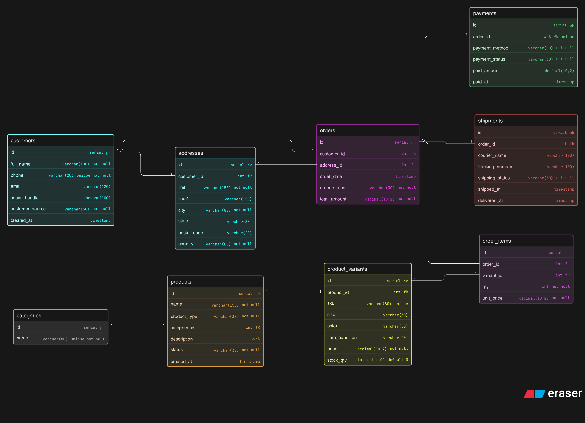

# Instagram-Thrift-Creator-Store-DB-Design

# Mental Map

-- Customer Order Flow (Instagram / WhatsApp Store)

1. customer sends message →
   we store in customer table
   (full_name, phone, social_handle)

2. customer source tracked →
   customer_source =
   instagram / whatsapp / website / offline

3. business adds product →
   we store in products table
   (name, product_type, category)

4. then map sellable item to product_variants →
   store:
     - size
     - color
     - item_condition
     - price
     - stock_qty
     - sku

5. system checks stock →
   product_variants.stock_qty > 0

6. customer confirms purchase →
   create orders record
   store:
     - customer_id
     - address_id
     - order_date
     - order_status = pending

7. add ordered products →
   create order_items rows
   store:
     - order_id
     - variant_id
     - qty
     - unit_price

8. calculate order total →
   update orders.total_amount

9. reduce stock →
   product_variants.stock_qty - qty

10. order is now placed

-- While Order Processing

- order exists when delivered not completed
- payment may be pending / paid
- shipment may be pending / shipped
- track using orders + payments + shipments

-- Payment Flow

1. customer pays →
   UPI / COD / bank transfer

2. create payments record →
   store:
     - order_id
     - payment_method
     - payment_status
     - paid_amount
     - paid_at

3. update order →
   order_status = confirmed

-- Shipping Flow

1. package ready →
   create shipments row

2. store:
   - order_id
   - courier_name
   - tracking_number
   - shipping_status = shipped
   - shipped_at = now

3. once delivered →
   update:
   - shipping_status = delivered
   - delivered_at = now

4. update orders →
   order_status = delivered

-- Thrift Item Logic

1. product_type = thrift

2. usually:
   - single variant
   - stock_qty = 1
   - condition important

3. once sold →
   stock_qty = 0
   status = sold_out

-- Handmade Item Logic

1. product_type = handmade

2. can have many variants:
   - size
   - color

3. can have reusable stock:
   stock_qty > 1
